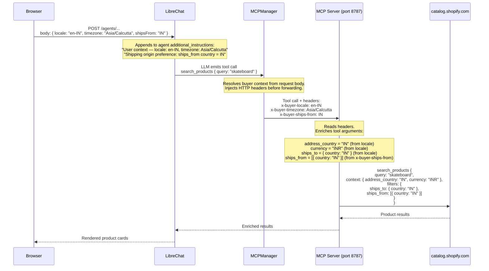

# Buyer Context Headers — Header-Driven MCP Enrichment

## Why headers, not prompts

A naive approach is to tell the LLM in the system prompt: "always include `address_country: IN` in your tool calls." This is fragile:

- The model may forget, especially in long conversations.
- It adds reasoning overhead to every tool call.
- It creates a dependency between prompt quality and correct API behavior.
- There is no way to enforce it — if the model omits the field, the call silently proceeds without filtering.

The approach used here is **deterministic header injection**: LibreChat attaches buyer context as HTTP headers on every MCP tool call. The MCP server reads the headers and enriches the tool arguments itself, before forwarding to the upstream catalog API. The LLM never needs to know about locale, currency, or shipping origin — it just calls `search_products` with a natural-language query.

---

## Flow



---

## Where each piece lives

### Frontend → LibreChat request body

**`packages/data-provider/src/createPayload.ts`**

On every message submission, the browser reads:

| Field | Source | Example |
|---|---|---|
| `locale` | `navigator.language` | `en-IN` |
| `timezone` | `Intl.DateTimeFormat().resolvedOptions().timeZone` | `Asia/Calcutta` |
| `shipsFrom` | `localStorage.getItem('comergent_ships_from')` | `IN` |

These are included in the POST body automatically — no user action required for locale/timezone. `shipsFrom` is set via the country selector button in the chat input bar.

### LibreChat → MCP headers

**`packages/api/src/mcp/MCPManager.ts`** — inside `callTool()`, after resolving connection options:

```ts
if (requestBody?.locale) {
  resolvedHeaders['x-buyer-locale'] = requestBody.locale;
}
if (requestBody?.timezone) {
  resolvedHeaders['x-buyer-timezone'] = requestBody.timezone;
}
if (requestBody?.shipsFrom) {
  resolvedHeaders['x-buyer-ships-from'] = requestBody.shipsFrom;
}
```

These headers are injected on **every MCP tool call**, regardless of which tool the LLM chose to invoke. The LLM's tool call JSON is never modified.

### System prompt (secondary signal)

**`packages/api/src/agents/initialize.ts`** — appended to `additional_instructions`:

```
User context — locale: en-IN, timezone: Asia/Calcutta
Shipping origin preference: ships_from country = IN. Always include
"ships_from": [{"country": "IN"}] in search_products catalog arguments
unless the buyer explicitly requests a different country.
```

This is a **soft hint** to the LLM, not the enforcement mechanism. The headers are the enforcement mechanism. The prompt instruction acts as a fallback for cases where the MCP server doesn't handle a given header yet.

### MCP server (enrichment)

**`host.docker.internal:8787/mcp`** (Comergent MCP server, external to LibreChat)

The MCP server reads the incoming HTTP headers and adds the appropriate fields to the tool call arguments before calling the upstream catalog API. Currently implemented for `x-buyer-locale` and `x-buyer-timezone`. The `x-buyer-ships-from` header is forwarded by LibreChat but requires a corresponding handler in the MCP server to inject `ships_from: [{country: "..."}]` into the catalog args.

---

## Why this matters

| Approach | Reliability | Overhead | Enforceable |
|---|---|---|---|
| Tell the LLM in the prompt | Low — model can forget | Adds reasoning load | No |
| Header injection in MCPManager | High — fires on every tool call | Zero reasoning cost | Yes |

The header approach is also **conversation-length independent** — it works on the 50th message the same as the first, because it reads from the HTTP request body, not from the model's context window.

---

## Adding a new buyer context field

1. Add the field to `TPayload` in `packages/data-provider/src/types.ts`
2. Read it in `createPayload.ts` and include it in the payload
3. Inject it as a header in `MCPManager.ts` alongside the existing `x-buyer-*` headers
4. Add a handler in the MCP server to read the header and enrich tool arguments
5. (Optional) Add a UI control — see `client/src/components/Chat/Input/CountrySelector.tsx` for the pattern
